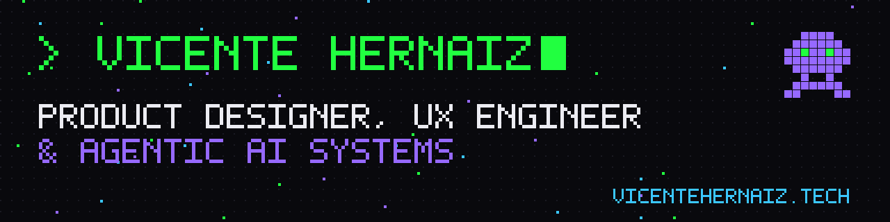

### Hi, I'm Vicente 👋

**Product/UX designer who builds what he designs, with AI agents.**
BFA UX Design at SCAD (Atlanta) · ex-professional cyclist · English & Spanish

I design products end to end (research, IA, UI, design systems) and ship them in code. Most of my work runs on a multi-agent system I built on Claude Code: specialist agents for research, UX, design systems and front-end, working from written specs and passing quality gates before anything ships.

🌐 [vicentehernaiz.tech](https://vicentehernaiz.tech) · 💼 [LinkedIn](https://www.linkedin.com/in/vicente-hernaiz-ux) · 🎯 Looking for **Summer 2027** UX / product design / design engineering internships

---

#### Live client work
- [centrepointglobal.es](https://www.centrepointglobal.es/)
- [armstrongeducationalservices.com](https://www.armstrongeducationalservices.com/)
- [amgfisio.com](https://www.amgfisio.com/)

#### What I've open-sourced
| Repo | What it is |
|---|---|
| [ux-agents-starter](https://github.com/Vicentehersant/ux-agents-starter) | Multi-agent system for UX designers on Claude Code. Install in 2 minutes |
| [vhs-agents-and-skills](https://github.com/Vicentehersant/vhs-agents-and-skills) | 16 subagents + 8 skills from my agent OS: design systems, a11y, research, SEO/GEO, CRO |
| [design-system-os](https://github.com/Vicentehersant/design-system-os) | My method for agent-ready design systems: tokens, design.md, specs, quality gates |
| [portfolio-ai](https://github.com/Vicentehersant/portfolio-ai) | The AI assistant from my portfolio as an installable template: JSON knowledge base + Claude endpoint + chat widget |
| [monkey-menubar](https://github.com/Vicentehersant/monkey-menubar) | A pixel monkey in the macOS menu bar that tells you what your Claude Code sessions are doing |
| [loud-ideas-calm-grid](https://github.com/Vicentehersant/loud-ideas-calm-grid) | How I present: a Pinterest redesign direction as a live Next.js + GSAP deck ([live](https://loud-ideas-calm-grid.vercel.app)) |
| [UX-UI-resources](https://github.com/Vicentehersant/UX-UI-resources) | Curated tools for designers who ship code |

#### Tools I work with
Figma · Next.js · React · TypeScript · Tailwind · shadcn/ui · GSAP · Supabase · Vercel · Claude Code · MCP

#### How I work
- **Research before pixels.** Interviews, field studies and usability tests decide the design.
- **Design system first.** Tokens and components before screens; WCAG AA by default.
- **Specs that agents can build from.** I write the spec, agents build, I review every diff.
